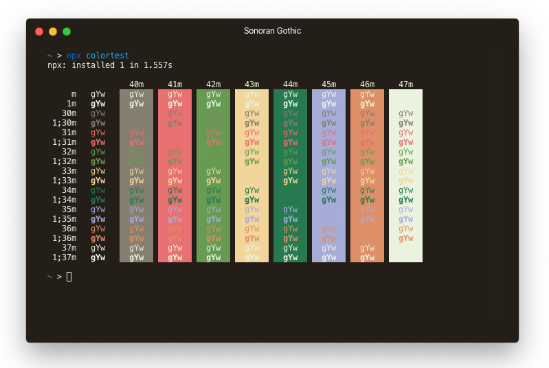

## Sonoran Gothic

**Amuse-bouche**

Dark, desert tones highlighted by pastel shades of mesa and pine forests. A color scheme for the Hyper terminal based off the SonoraBuild Minecraft server color palette, with influence from hyper-rose-pine.

**Appetizer**

**Main Course**

[Hyper](https://www.npmjs.com/package/hyper-sonoran-gothic)

[VS Code (Soon to come...)]()

**Dessert**

Credits to [hyper-rose-pine](https://github.com/fvrests/hyper-rose-pine) for the inspiration.

